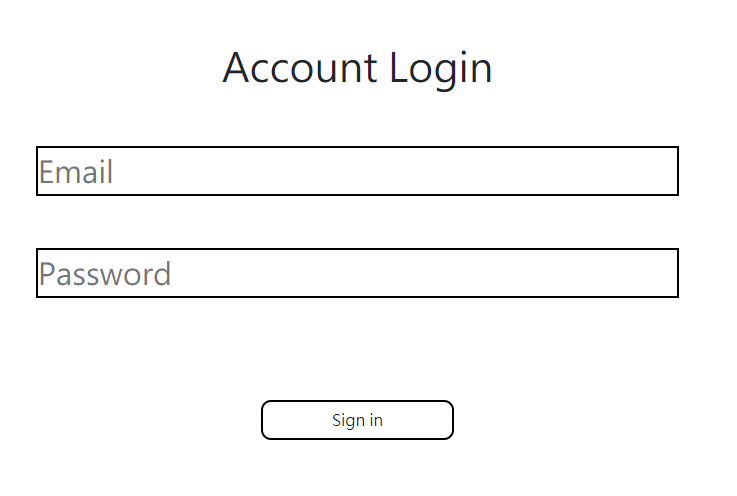

# Account Login #


### 簡介

用來練習登入帳號的介面  
沒錯登入跟分手一樣 都是需要練習的

---

### 程式需求&安裝

- _Node.js_
- _Express_
- _Express-handlebars_
- _body-parser_

---

### 安裝流程

1.首先從終端機(Terminal) 複製專案到你的電腦裡
```
  git clone https://github.com/Dennnnny/account_login.git
```

2.從終端機進入專案資料夾
```
  cd Account-login-file
```
3.安裝 Node.js(用nvm安裝Node.js 10.15.0版本)
``` 
  nvm install 10.15.0
```
4.使用npm安裝express ...等套件
```
  npm install express express-handlebars body-parser
```
5.使用node開啟伺服器，執行app.js
```
  node app.js
```
當終端機出現以下畫面表示伺服器連接成功
```
  listening on localhost:3000

```
恭喜！
這表示你可以從 [localhost:3000](localhost:3000) 網頁進入網站了


---
### 使用說明

目前僅能使用以下帳號密碼登入 
```

   ----------Tony----------
   email: tony@stark.com
   password: iamironman
   ========================
 
   ---------Steve----------
   email: captain@hotmail.com
   password: icandothisallday
   ========================

   ---------Peter----------
   email: peter@parker.com
   password: enajyram
   ========================

   ---------Natasha--------
   email: natasha@gamil.com
   password: *parol#@$!
   ========================

   ----------Nick----------
   email: nick@shield.com
   password: password
   ========================
```
歡迎使用以上帳號做登入練習  
有朝一日你也能加入復仇者聯盟的


---
### 畫面



---
### 開發人員

[Dennnnny](https://github.com/Dennnnny)

---
### 後記

做README真的好難啊 
希望下次我可以做個比現在這個更好的README 
